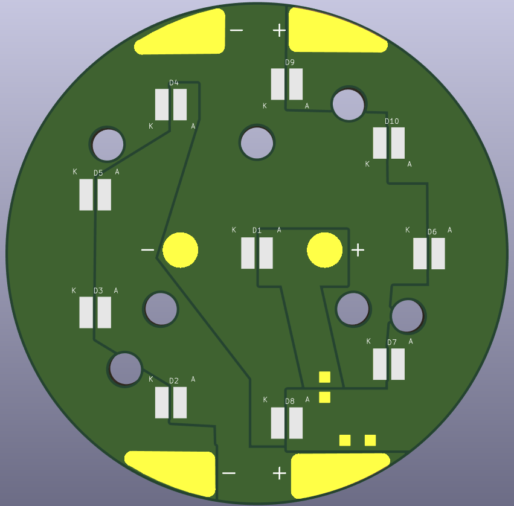

# 🔦 [Cheap Strong Flashlight]

A high-performance, flashlight project. This design prioritizes cheap high power flashlight creation with a **single-layer PCB** layout, making it cost effective.

---

## 🛠 Technical Specifications

This project is engineered for [e.g., high brightness/long battery life]. By using a single-layer design, we simplify the manufacturing process while maintaining robust electrical paths.

* **PCB Layers:** 1 Layer (Single-sided)
* **Material:** [Recomended Aluminum (or copper $$$) PCB for heat dissipation]
* **LED Count:** [10]
* **LED Type:** [CREE JU7070 K Series (I used JU7070BWT-K-B40ED0000-N0000001)]
* **Drive Current:** [0-1200 mA depending on the voltage (700 mA at 11.8 volts)]
* **Input Voltage:** [10.5-12.4 Volts (optimal is 11.8 V to not release the smoke)]
* **Power:** [With 10 LEDs 0-148.8 W (82.6 W at 11.8 V)]

---

## 📐 Hardware Design

### PCB Layout
The board is designed with large solder pours to handle the current requirements of high-power LEDs and to reduce voltage drop across the circuit.

* **Substrate:** Aluminum-core PCB is highly recommended if running the LEDs at maximum brightness to prevent things from getting too toasty.
* **Solder Mask:** [I chose white (it's the cheapest option on JLC for aluminum)]

### Bill of Materials (BOM)

| Component | Type | Quantity | Notes |
| :--- | :--- | :--- | :--- |
| **LED** | [JU7070BWT-K-B40ED0000-N0000001] | [10] | [Color Temp, e.g., 5000K] |
| **Resistor** | [Not used] | [0] | Current limiting |
| **Switch** | [Insert Type] | 1 | [e.g., Reverse clicky] |
| **Battery** | [DCB 120] | 1 | [Had cheap Dewalt batteries laying around] |
[**NOTE ON BATTERY: MAKE SURE THAT YOU CEHCK YOUR INPUT IS AROUND 12V (11.8 V is what you should aim for the higher you go, the more heat you make)**]
---

## 🚀 Assembly Instructions

1.  **Fabrication:** Export the Gerber files located in `/fabrication` and send them to your preferred PCB manufacturer.
2.  **Solder Components:** * Apply solder paste or flux to the pads.
    * Place the LEDs, ensuring correct polarity (Anode vs. Cathode).
    * Use a reflow plate (recommended for Aluminum PCBs) or a soldering iron.
3.  **Housing:** Fit the PCB into the [Insert Housing/Enclosure Name]. Ensure the LEDs align with the optics/reflector.
4.  **Testing:** Power the device using a limited current source first to ensure there are no shorts.

---

## 📂 Project Structure

* `/hardware` - KiCad design files.
* `/fabrication` - Ready-to-order Gerber files.
* `/enclosure` - 3D printable files (.STL) for the flashlight body.
* `/docs` - Datasheets for LEDs and components.

---

## ⚖️ License
This project is licensed under the [MIT License](LICENSE).

---

## 🤝 Contributing
If you know best practices for thermal vias and stuff like that. Feel free to contact me, I want to learn how to do them.
